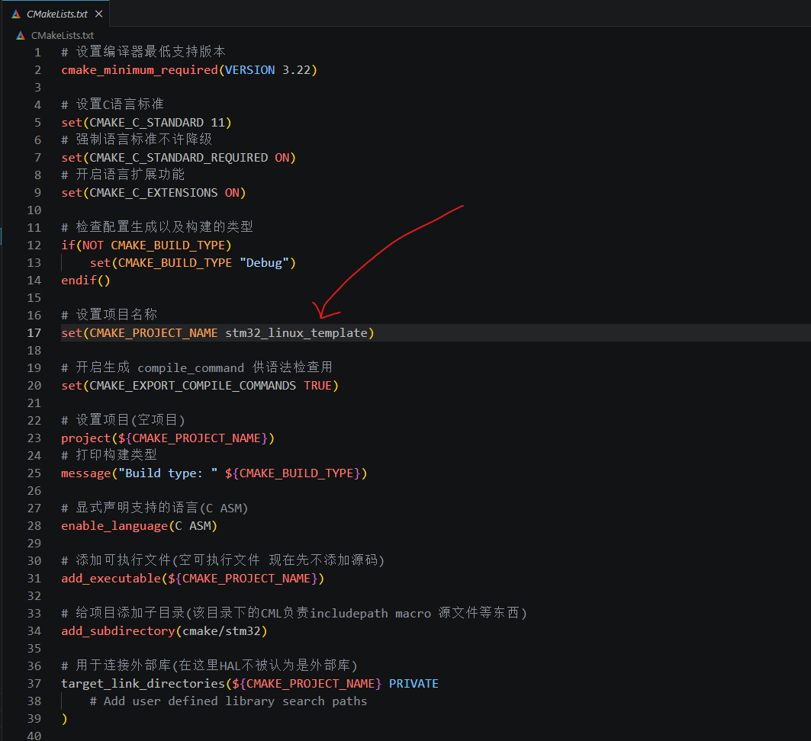
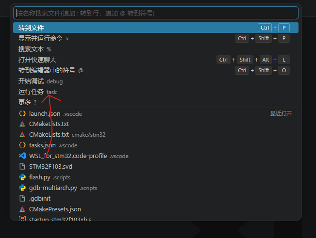
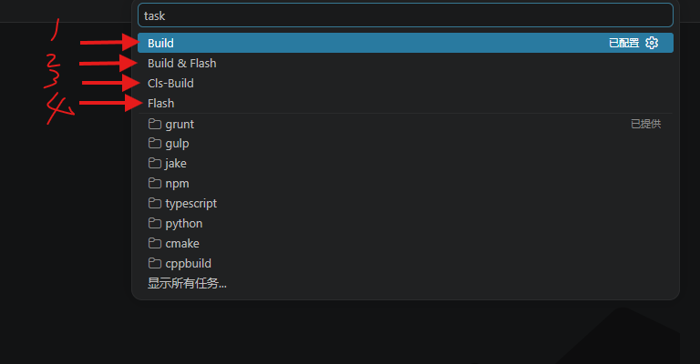
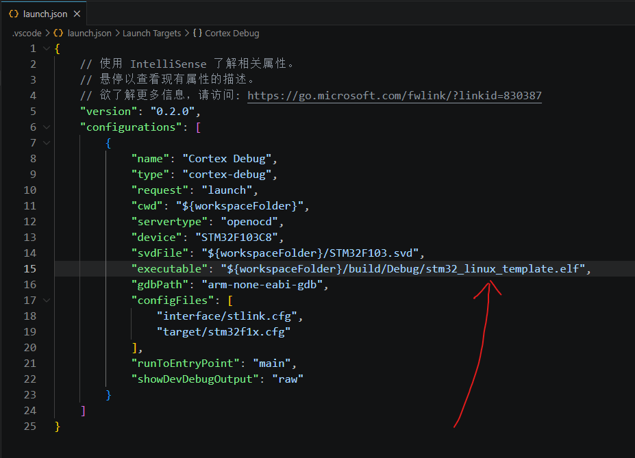
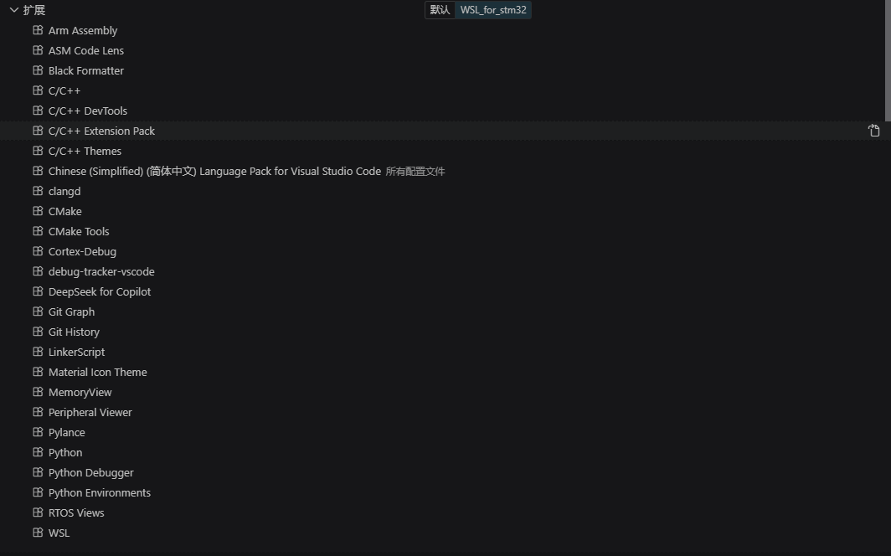

# STM32 Linux 裸机开发模板

基于 **CMake + ARM GCC + OpenOCD** 的 STM32F103 裸机开发模板，在 Linux 环境下提供完整的编辑、编译、烧录、调试工具链。

---

## 目录

- [1. 项目简介](#1-项目简介)
- [2. 硬件要求](#2-硬件要求)
- [3. 软件依赖](#3-软件依赖)
- [4. 项目结构](#4-项目结构)
- [5. 快速开始](#5-快速开始)
  - [5.1 环境准备](#51-环境准备)
  - [5.2 配置项目名称](#52-配置项目名称)
  - [5.3 编译](#53-编译)
  - [5.4 烧录](#54-烧录)
  - [5.5 调试](#55-调试)
- [6. VS Code 集成](#6-vs-code-集成)
  - [6.1 任务系统](#61-任务系统)
  - [6.2 调试配置](#62-调试配置)
  - [6.3 语法提示](#63-语法提示)
- [7. CMake 构建系统详解](#7-cmake-构建系统详解)
  - [7.1 工具链文件](#71-工具链文件)
  - [7.2 子项目配置](#72-子项目配置)
  - [7.3 编译选项](#73-编译选项)
- [8. 添加自己的代码](#8-添加自己的代码)
  - [8.1 添加源文件](#81-添加源文件)
  - [8.2 添加头文件路径](#82-添加头文件路径)
  - [8.3 添加预处理宏](#83-添加预处理宏)
  - [8.4 添加外部库](#84-添加外部库)
- [9. 常见问题](#9-常见问题)

---

## 1. 项目简介

这是一个面向 **STM32F103C8 (Cortex-M3)** 的裸机固件开发模板，专为 Linux 开发环境设计。

**核心特性：**

| 特性 | 说明 |
|------|------|
| **MCU** | STM32F103C8（128KB Flash / 20KB RAM） |
| **HAL 库** | STM32F1xx HAL Driver（按需裁剪） |
| **构建系统** | CMake 3.22+ + Ninja |
| **编译器** | arm-none-eabi-gcc（C11） |
| **调试器** | OpenOCD + arm-none-eabi-gdb + Cortex-Debug |
| **IDE** | VS Code（tasks.json + launch.json 开箱即用） |
| **语言支持** | C + 汇编 |

**设计理念：** 通过 CMake 的 `INTERFACE` 库和 `OBJECT` 库将 HAL 驱动层与应用层解耦，用户只需在指定位置添加源文件和头文件路径即可开始开发，无需修改 HAL 库本身的构建逻辑。

---

## 2. 硬件要求

| 硬件 | 说明 |
|------|------|
| **开发板** | STM32F103C8 最小系统板（Blue Pill 或同等） |
| **调试器** | ST-Link V2（或兼容的调试器） |
| **连接线** | USB 转 ST-Link 连接线 |

> **注意：** 如果使用其他 STM32F103xB 型号（如 STM32F103RB），需要修改链接脚本 `STM32F103XB_FLASH.ld` 中的 Flash/RAM 大小，以及 `cmake/stm32/CMakeLists.txt` 中的 `STM32F103xB` 宏。

---

## 3. 软件依赖

### 必须安装

```bash
# Ubuntu / Debian
sudo apt install cmake ninja-build        # 构建系统
sudo apt install gcc-arm-none-eabi        # ARM 交叉编译器
sudo apt install openocd                   # 调试 & 烧录
sudo apt install gdb-multiarch             # GDB 调试器
```

### 推荐安装（VS Code 插件）

项目提供了导出的 VS Code 配置文件 **`.vscode/WSL_for_stm32.code-profile`**，**一键导入即可自动安装全部所需插件并完成配置**，省去手动逐个安装的麻烦。详见 [6.4 一键导入 VS Code 配置](#64-一键导入-vs-code-配置)。

如果希望手动安装，以下是核心插件：

| 插件 | 用途 |
|------|------|
| **Cortex-Debug** (`marus25.cortex-debug`) | 图形化调试 |
| **clangd** (`llvm-vs-code-extensions.vscode-clangd`) | C/C++ 语法提示 |
| **CMake Tools** (`ms-vscode.cmake-tools`) | CMake 集成（可选） |

> **说明：** 本项目使用 `.clangd` 配置文件提供语法检查，已指向 `build/Debug/compile_commands.json`。如果使用 clangd 插件，请在 VS Code 中**禁用** Microsoft C/C++ IntelliSense 以避免冲突。

---

## 4. 项目结构

```
stm32_linux_template/
├── CMakeLists.txt                  # 顶层 CMake 配置（用户入口）
├── CMakePresets.json               # CMake 预设（Debug / Release）
├── STM32F103XB_FLASH.ld            # 链接脚本（128KB Flash / 20KB RAM）
├── STM32F103.svd                   # SVD 外设寄存器描述文件
├── startup_stm32f103xb.s           # 启动文件（汇编、中断向量表）
│
├── .vscode/
│   ├── launch.json                 # 调试配置（Cortex-Debug）
│   ├── tasks.json                  # VS Code 任务（Build / Flash 等）
│   └── WSL_for_stm32.code-profile  # VS Code 配置文件（一键导入插件和设置）
│
├── .scripts/
│   ├── build.py                    # 构建脚本
│   ├── flash.py                    # 烧录脚本
│   └── cls-build.py                # 清理构建脚本
│
├── cmake/
│   ├── gcc-arm-none-eabi.cmake     # 交叉编译工具链文件
│   └── stm32/
│       └── CMakeLists.txt          # HAL 库 & 应用层子项目配置
│
├── Core/                           # 用户代码区
│   ├── User/
│   │   └── main.c                  # 主函数入口
│   ├── Hw/
│   │   ├── Inc/                    # 硬件驱动头文件
│   │   │   ├── LED.h               #   LED 驱动（示例）
│   │   │   └── stm32f1xx_it.h      #   中断服务函数声明
│   │   └── Src/                    # 硬件驱动源文件
│   │       ├── LED.c               #   LED 驱动（示例）
│   │       └── stm32f1xx_it.c      #   中断服务函数实现
│   └── Sys/
│       ├── Inc/
│       │   └── rcc.h               # 时钟配置头文件
│       └── Src/
│           └── rcc.c               # 时钟配置（HSE 8MHz → PLL 72MHz）
│
├── Drivers/
│   ├── STM32F1xx_HAL_Driver/       # STM32 HAL 库源码
│   └── CMSIS/                      # CMSIS（Cortex-M 软件接口标准）
│
├── build/
│   └── Debug/                      # 构建输出（自动生成）
│       ├── stm32_linux_template.elf
│       ├── stm32_linux_template.map
│       └── compile_commands.json
│
└── docs/
    └── images/                     # 文档图片
```

---

## 5. 快速开始

### 5.1 环境准备

1. 安装必须的软件依赖（参见 [3. 软件依赖](#3-软件依赖)）
2. 用 VS Code 打开本项目文件夹
3. 连接 ST-Link 调试器到开发板和电脑

### 5.2 配置项目名称

打开顶层 `CMakeLists.txt`，修改项目名称：

```cmake
# 第17行 - 设置项目名称
set(CMAKE_PROJECT_NAME stm32_linux_template)   # ← 改成你的项目名称
```

> **注意：** 项目名称会直接影响最终生成的 ELF 文件名（`build/Debug/<项目名>.elf`），调试配置 `launch.json` 中的 `executable` 路径也需要同步修改。

> ⚠️ **重要：** 修改项目名称后，必须**先执行 Cls-Build 任务清理旧的构建产物**，再重新 Build，才能生成正确命名的可执行文件。否则 CMake 可能沿用缓存中的旧名称。
>
> 操作步骤：
> 1. `Ctrl+Shift+P` → `task` → **"Cls-Build"**（清理 build 目录）
> 2. `Ctrl+Shift+P` → `task` → **"Build"**（重新编译）
>
> 或者直接使用 **"Cls-Build"** 任务，清理后手动触发 Build。



### 5.3 编译

#### 方式一：VS Code 任务（推荐）

1. 按 `Ctrl+Shift+P` 打开命令面板
2. 输入 `task` 选择 **"运行任务"**



3. 在弹出的任务列表中选择 **"Build"**



#### 方式二：命令行

```bash
# 使用 CMake Preset 配置
cmake --preset Debug

# 编译
cmake --build build/Debug
```

#### 方式三：Python 脚本

```bash
python3 .scripts/build.py
```

编译成功后，产物位于 `build/Debug/` 目录下：

| 文件 | 说明 |
|------|------|
| `stm32_linux_template.elf` | 可执行文件（含调试信息） |
| `stm32_linux_template.map` | 内存映射文件（函数地址、Flash/RAM 占用） |
| `compile_commands.json` | 编译命令数据库（供 clangd 使用） |

### 5.4 烧录

> **前提：** ST-Link 已连接，OpenOCD 已安装。

#### 方式一：VS Code 任务（推荐）

在任务列表中选择 **"Flash"** 或 **"Build & Flash"**（先编译再烧录）。

#### 方式二：命令行

```bash
openocd -f interface/stlink.cfg \
        -f target/stm32f1x.cfg \
        -c "program build/Debug/stm32_linux_template.elf verify reset exit"
```

#### 方式三：Python 脚本

```bash
python3 .scripts/flash.py
```

### 5.5 调试

#### 方式一：Cortex-Debug 图形化调试（推荐）

1. 确保已安装 VS Code 插件 **Cortex-Debug**
2. 按 `F5` 或点击左侧 **"运行和调试"** 图标
3. 选择 **"Cortex Debug"** 配置启动

调试配置（`.vscode/launch.json`）说明：



| 配置项 | 说明 |
|--------|------|
| `servertype: "openocd"` | 使用 OpenOCD 作为 GDB 服务器 |
| `device: "STM32F103C8"` | 目标芯片型号 |
| `svdFile` | SVD 外设寄存器描述文件路径 |
| `executable` | 要调试的 ELF 文件路径 |
| `configFiles` | OpenOCD 配置文件（stlink + stm32f1x） |
| `runToEntryPoint: "main"` | 自动运行到 main 函数 |

#### 方式二：命令行 GDB

```bash
# 终端1：启动 OpenOCD 服务器
openocd -f interface/stlink.cfg -f target/stm32f1x.cfg

# 终端2：连接 GDB（项目根目录下执行，自动加载 .gdbinit）
arm-none-eabi-gdb build/Debug/stm32_linux_template.elf
```

`.gdbinit` 文件包含了自动连接、烧录、设断点的命令，启动 GDB 后会自动执行。

---

## 6. VS Code 集成

### 6.1 任务系统

项目预置了 4 个 VS Code 任务（`.vscode/tasks.json`）：

| 任务 | 说明 | 底层命令 |
|------|------|----------|
| **Build** | 编译项目 | `python3 .scripts/build.py` |
| **Flash** | 烧录固件 | `python3 .scripts/flash.py` |
| **Build & Flash** | 编译 + 烧录（顺序执行） | 先 Build 再 Flash |
| **Cls-Build** | 清理旧的构建目录 | `python3 .scripts/cls-build.py` |

使用方式：
- `Ctrl+Shift+P` → 输入 `task` → **"运行任务"** → 选择对应任务
- 或绑定快捷键到常用任务

### 6.2 调试配置

调试配置文件 `.vscode/launch.json` 已预置 **"Cortex Debug"** 配置：

- 自动启动 OpenOCD 服务器
- 自动烧录固件
- 自动运行到 `main()` 函数
- 支持外设寄存器查看（通过 SVD 文件）
- `showDevDebugOutput: "raw"` 显示详细调试日志

> **提示：** 如果更换了芯片型号，需要同步修改 `device`、`svdFile`、`configFiles` 字段。

### 6.3 语法提示

项目使用 **clangd** 提供 C/C++ 语法提示，配置文件 `.clangd` 已指向编译命令数据库：

```yaml
CompileFlags:
  CompilationDatabase: build/Debug    # 从 compile_commands.json 读取编译参数
```

**配置步骤：**

1. 安装 VS Code 插件 `clangd`
2. 在 VS Code 设置中将 clangd 设为默认语言服务器（或禁用 Microsoft C/C++ IntelliSense）
3. 完成一次编译生成 `compile_commands.json`
4. 重启 VS Code，语法提示即可生效

### 6.4 一键导入 VS Code 配置

项目包含一个已导出的 VS Code 配置文件 **`.vscode/WSL_for_stm32.code-profile`**，内含本项目开发所需的全部插件和设置。导入后 VS Code 将自动安装所有插件并应用预设配置，**无需手动逐个安装**。

**配置文件包含的内容：**

| 类别 | 内容 |
|------|------|
| **核心插件** | C/C++ Extension Pack、clangd、CMake Tools、Cortex-Debug |
| **嵌入式调试** | Peripheral Viewer（外设寄存器）、MemoryView（内存查看）、RTOS Views（RTOS 任务监控）、debug-tracker |
| **汇编支持** | Arm Assembly、ASM Code Lens、LinkerScript |
| **开发辅助** | Python（脚本工具）、Git Graph、Git History、Material Icon Theme |
| **关键设置** | 禁用 Microsoft IntelliSense（改用 clangd）、clangd 指向 ARM GCC、自动保存、字体大小等 |

**导入步骤：**

1. 在 VS Code 中，点击左下角 **齿轮图标** ⚙️
2. 选择 **"配置文件"** → **"导入配置文件"**
3. 在弹出的文件选择器中，选择项目中的 **`.vscode/WSL_for_stm32.code-profile`**
4. 点击 **"导入"**，VS Code 会自动安装所有插件并应用设置
5. 导入完成后，可以在右上角或左下角切换到 **"WSL_for_stm32"** 配置文件



> **提示：** 上图展示了导入后扩展面板顶部的配置文件选项卡，可以看到 "WSL_for_stm32" 已就绪。切换到此配置后，所有插件和设置会自动生效。如果部分插件安装失败（网络原因），可以稍后手动在扩展商店搜索安装。

> ⚠️ **注意：** 配置文件中 clangd 的 `--query-driver` 路径指向作者本机的 ARM GCC 安装路径。如果你的 ARM GCC 安装位置不同，导入后需要在 VS Code 设置中搜索 `clangd.arguments`，将路径修改为你本机的 `arm-none-eabi-gcc` 所在位置。

---

## 7. CMake 构建系统详解

### 7.1 工具链文件

`cmake/gcc-arm-none-eabi.cmake` 配置了交叉编译工具链：

```cmake
set(TOOLCHAIN_PREFIX arm-none-eabi-)
set(CMAKE_C_COMPILER   ${TOOLCHAIN_PREFIX}gcc)
set(CMAKE_ASM_COMPILER ${TOOLCHAIN_PREFIX}gcc)
set(CMAKE_CXX_COMPILER ${TOOLCHAIN_PREFIX}g++)
set(CMAKE_LINKER       ${TOOLCHAIN_PREFIX}g++)
set(CMAKE_OBJCOPY      ${TOOLCHAIN_PREFIX}objcopy)
set(CMAKE_SIZE         ${TOOLCHAIN_PREFIX}size)
```

**关键参数：**

| 参数 | 说明 |
|------|------|
| `-mcpu=cortex-m3` | 目标 CPU 架构 |
| `-Wall` | 开启常见警告 |
| `-fdata-sections` / `-ffunction-sections` | 每个变量/函数独立 section（配合 GC） |
| `-fstack-usage` | 生成栈分析信息 |
| `-Wl,--gc-sections` | 链接器垃圾回收（去除未使用代码） |
| `-Wl,--print-memory-usage` | 链接后打印内存占用 |
| `--specs=nano.specs` | 使用精简 C 库（减小体积） |
| `--specs=nosys.specs` | 提供裸机系统调用 stub |

**Debug vs Release：**

| 构建类型 | 优化等级 | 调试信息 |
|----------|----------|----------|
| Debug | `-O0`（不优化） | `-g3`（完整调试信息） |
| Release | `-Os`（优化体积） | `-g0`（无调试信息） |

### 7.2 子项目配置

`cmake/stm32/CMakeLists.txt` 采用库分层设计：

```
stm32_conf (INTERFACE)         ← 头文件路径 + 预处理宏（传播给所有依赖者）
    ↑
STM32_Drivers (OBJECT)         ← HAL 库源码（编译为 .o 文件）
    ↑
${CMAKE_PROJECT_NAME} (EXE)     ← 应用层源码 + 启动文件 + 链接 HAL .o
```

- **`stm32_conf`**（INTERFACE 库）：不产生编译产物，仅用于传播头文件路径和预处理宏
- **`STM32_Drivers`**（OBJECT 库）：编译 HAL 库源文件为 `.o`，最终直接链接进 ELF
- **顶层可执行文件**：包含应用层源码 + 启动文件，链接 HAL 的 `.o` 文件

### 7.3 编译选项

**预处理宏**（`cmake/stm32/CMakeLists.txt` 第 9-13 行）：

| 宏 | 说明 |
|----|------|
| `USE_HAL_DRIVER` | 启用 HAL 驱动 |
| `STM32F103xB` | 芯片型号（128KB Flash） |
| `DEBUG` | 仅在 Debug 配置下自动定义 |

---

## 8. 添加自己的代码

### 8.1 添加源文件

在**顶层** `CMakeLists.txt` 的 `target_sources` 中添加你的 `.c`/`.s` 文件：

```cmake
target_sources(${CMAKE_PROJECT_NAME} PRIVATE
    # Add user sources here
    Core/User/my_module.c            # ← 添加你自己的 .c 文件
    Core/Hw/Src/my_driver.c          # ← 添加硬件驱动
)
```

如果需要往 HAL 库中添加驱动文件（如 `stm32f1xx_hal_tim.c`），修改 `cmake/stm32/CMakeLists.txt` 中的 `STM32_Drivers_Src` 变量。

### 8.2 添加头文件路径

在顶层 `CMakeLists.txt` 的 `target_include_directories` 中添加：

```cmake
target_include_directories(${CMAKE_PROJECT_NAME} PRIVATE
    # Add user defined include paths
    Core/User                       # ← 你自己的头文件目录
)
```

### 8.3 添加预处理宏

在顶层 `CMakeLists.txt` 的 `target_compile_definitions` 中添加：

```cmake
target_compile_definitions(${CMAKE_PROJECT_NAME} PRIVATE
    # Add user defined symbols
    MY_CUSTOM_MACRO=1               # ← 你的自定义宏
)
```

### 8.4 添加外部库

1. 将 `.a` 文件放入项目目录
2. 在 `cmake/stm32/CMakeLists.txt` 的 `MX_LINK_DIRS` 中添加库搜索路径
3. 在 `MX_LINK_LIBS` 中添加库名

```cmake
set(MX_LINK_DIRS
    ${CMAKE_CURRENT_SOURCE_DIR}/../../Lib    # 库文件目录
)

set(MX_LINK_LIBS 
    STM32_Drivers
    ${TOOLCHAIN_LINK_LIBRARIES}
    my_external_lib                           # 你的外部库名（去掉 lib 前缀和 .a 后缀）
)
```

---

## 9. 常见问题

### Q: 编译报错 `arm-none-eabi-gcc: command not found`

**A:** 未安装 ARM 交叉编译器，执行：
```bash
sudo apt install gcc-arm-none-eabi
```

### Q: 烧录报错 `Error: open failed`

**A:** 检查 ST-Link 是否已连接，执行 `lsusb` 查看是否有 ST-Link 设备。如果在 WSL 中，需要使用 `usbipd` 将 ST-Link 设备绑定到 WSL。

### Q: 调试时断点不命中

**A:** 检查是否使用了 Debug 配置编译（`-O0 -g3`）。Release 模式下优化会破坏调试信息。

### Q: `compile_commands.json` 不存在

**A:** 需要先完成一次编译。该文件由 CMake 的 `CMAKE_EXPORT_COMPILE_COMMANDS` 选项生成。

### Q: clangd 报大量错误

**A:** 
1. 确认已完成一次编译（生成 `compile_commands.json`）
2. 确认 `.clangd` 中的 `CompilationDatabase` 路径正确
3. 在 VS Code 中执行 `clangd: Restart language server`

### Q: 如何修改系统时钟频率？

**A:** 编辑 `Core/Sys/Src/rcc.c`。当前配置为：
- 外部晶振（HSE）：8MHz
- PLL 倍频：×9
- 系统时钟（SYSCLK）：72MHz
- AHB：72MHz / APB1：36MHz / APB2：72MHz

### Q: 如何更换芯片型号？

**A:** 需要修改以下文件：
1. `cmake/stm32/CMakeLists.txt` — 修改 `STM32F103xB` 宏和 `-mcpu` 参数
2. `STM32F103XB_FLASH.ld` — 修改 Flash/RAM 大小
3. `.vscode/launch.json` — 修改 `device` 和 SVD 文件
4. `startup_stm32f103xb.s` — 替换为对应型号的启动文件

### Q: 如何查看固件的 Flash/RAM 占用？

**A:** 编译完成后，链接器会自动打印内存占用信息。也可以查看 `.map` 文件获取详细的内存分布：
```bash
cat build/Debug/stm32_linux_template.map
```

---

## 参考资料

- [STM32F103x8/xB 数据手册](https://www.st.com/resource/en/datasheet/stm32f103c8.pdf)
- [STM32F1xx HAL 驱动用户手册](https://www.st.com/resource/en/user_manual/um1850-description-of-stm32f1-hal-and-lowlayer-drivers-stmicroelectronics.pdf)
- [ARM GCC 工具链文档](https://developer.arm.com/Tools%20and%20Software/GNU%20Toolchain)
- [OpenOCD 用户指南](https://openocd.org/doc/html/index.html)
- [Cortex-Debug VS Code 插件](https://marketplace.visualstudio.com/items?itemName=marus25.cortex-debug)

---

> 🤖 本模板由 STM32 HAL Tutorial 项目维护，欢迎提交 Issue 或 PR。
