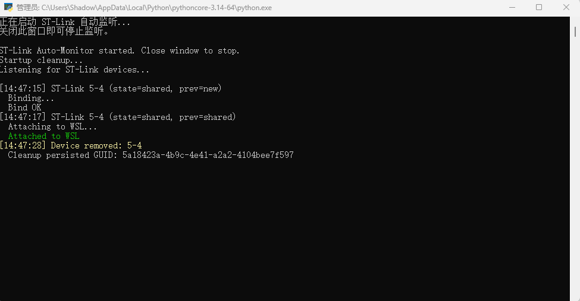

# ST-Link 自动连接 WSL 工具

在 Windows 端运行的自动监听脚本，用于**将 ST-Link 调试器自动接入 WSL**，使得 Linux 下的 OpenOCD / GDB 可以直接识别并使用 ST-Link。

---

## 工作原理

```
run_auto_attach.py                         auto_attach.ps1
  (Python 启动器)         ──调用──▶     (PowerShell 监听脚本)
  - 自动申请管理员权限                     - 检测 ST-Link 设备插入/拔出
  - 切换到脚本所在目录                     - 自动执行 usbipd bind + attach
  - 启动 PowerShell 脚本                   - 循环监控，设备移除后自动解绑
```

**核心流程：**

1. 监听 `usbipd list` 输出，寻找 USB VID `0483`（ST-Link）的设备
2. 发现新设备 → `usbipd bind`（绑定）→ `usbipd attach --wsl`（接入 WSL）
3. 设备拔出 → `usbipd unbind`（解绑）+ 清理残留 GUID
4. 循环运行，窗口关闭即停止

---

## 环境依赖（Windows 端）

使用此脚本前，请确保 Windows 上已安装以下软件：

| 依赖 | 说明 | 安装方式 |
|------|------|----------|
| **Python 3** | 运行 `run_auto_attach.py` 启动器 | [python.org](https://www.python.org/downloads/) 下载安装，安装时勾选 "Add Python to PATH" |
| **usbipd-win** | Windows USB/IP 守护进程，用于将 USB 设备共享给 WSL | `winget install usbipd` 或从 [GitHub Release](https://github.com/dorssel/usbipd-win/releases) 下载 `.msi` 安装 |
| **WSL** | Windows Subsystem for Linux，需已安装并运行目标发行版 | `wsl --install` |
| **PowerShell** | Windows 自带，无需额外安装 | — |

> **验证安装：** 在 Windows 命令行中执行以下命令，确认均有正常输出：
> ```powershell
> python --version
> usbipd list
> wsl --list
> ```

---

## 使用步骤

### 1. 将脚本文件夹复制到 Windows

> ⚠️ **此脚本必须在 Windows 端运行**（WSL 内无法直接操作 USB 设备）。

将整个 `autolink_windowstolinux_script` 文件夹**从 WSL/Linux 项目目录拖拽或复制到 Windows 的任意位置**（如桌面或 `C:\tools\`）。

### 2. 启动 WSL

确保目标 WSL 发行版已在运行：

```powershell
wsl --list --verbose
```

如果未运行，先启动：

```powershell
wsl
```

### 3. 运行脚本

双击 **`run_auto_attach.py`** 即可启动：

- 脚本会自动弹出 **UAC 管理员权限确认窗口**，点击 "是"（`usbipd` 命令需要管理员权限）
- 启动后窗口显示 `ST-Link Auto-Monitor started. Close window to stop.`
- 此时插入或拔出 ST-Link，窗口会实时显示状态日志

**运行效果截图：**



上图展示了一个完整的设备生命周期：
1. 启动监听 → 清理残留
2. `14:47:15` 检测到 ST-Link 设备 `5-4`，执行 Bind 并成功
3. `14:47:17` 将设备 Attach 到 WSL（绿色高亮）
4. `14:47:28` 设备拔出，自动清理残留 GUID（黄色高亮）

### 4. 在 WSL 中验证

ST-Link 成功接入后，在 WSL 终端中执行：

```bash
lsusb | grep ST-Link
```

应该能看到 ST-Link 设备。此时即可正常使用 OpenOCD 烧录和调试。

### 5. 停止监听

**关闭命令行窗口**即可停止监听。脚本会自动清理已绑定的设备。

---

## 故障排查

| 现象 | 可能原因 | 解决方法 |
|------|----------|----------|
| 双击 `.py` 文件无反应 | Python 未安装或未关联 `.py` 文件 | 安装 Python 3 并勾选 "Add to PATH"；或右键选择 "Python" 打开 |
| 提示 `usbipd: command not found` | usbipd-win 未安装 | `winget install usbipd` |
| `bind failed` | 设备被其他 Hyper-V 虚拟机占用 | 关闭其他虚拟机，或执行 `usbipd unbind --all` |
| `attach failed` | WSL 未运行或 usbipd 工具未在 WSL 中安装 | 确保 WSL 已启动；WSL 中需安装 `linux-tools-generic` 或对应内核工具 |
| 设备持续 `not_shared` | usbipd 服务异常 | 在 Windows PowerShell（管理员）中执行 `Restart-Service usbipd` |

---

## 使用完毕后

成功运行此脚本并确认 ST-Link 可以在 WSL 中正常工作后，**可以将 `autolink_windowstolinux_script/` 文件夹从项目中删除**（删除 WSL 端的副本即可，Windows 端保留以备后续使用）。

此脚本属于一次性辅助工具，不影响项目的编译、烧录和调试流程。

```bash
# 在项目根目录下执行即可删除
rm -rf autolink_windowstolinux_script
```
